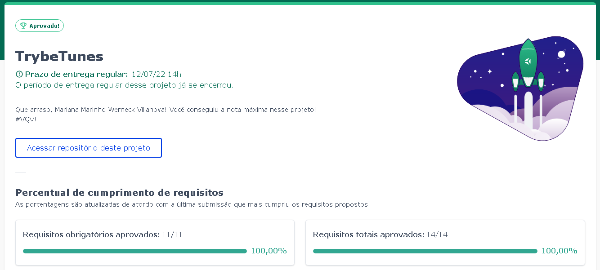
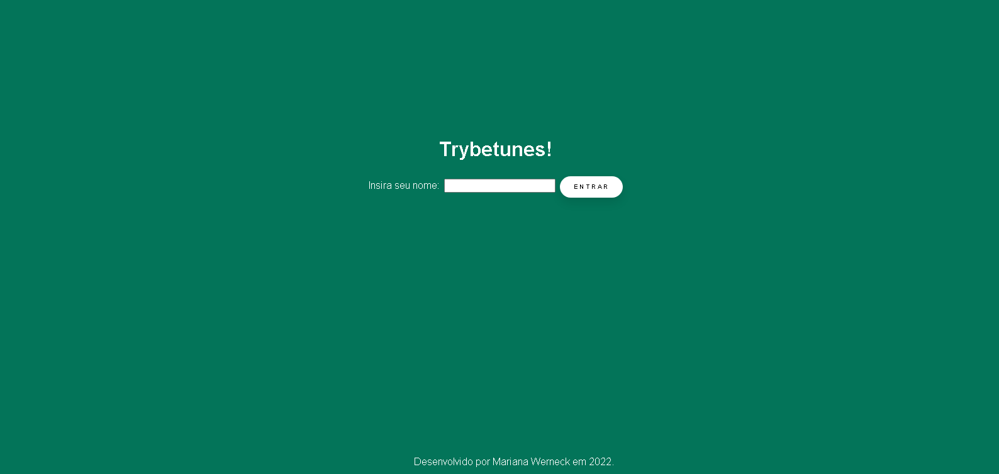
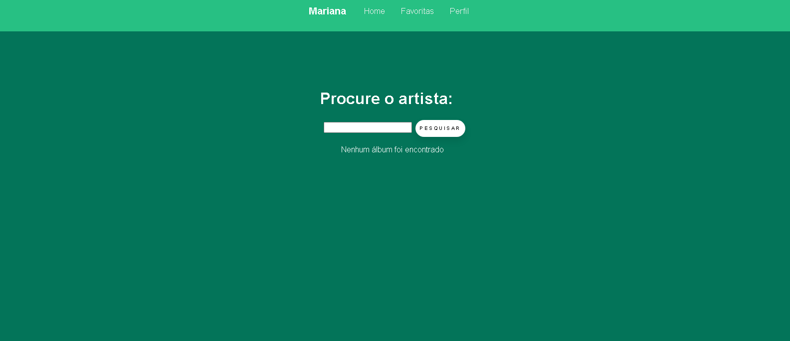

# Projeto Trybetunes!

Nesse projeto foi desenvolvido uma aplicação para encontrar álbuns de determinado artista utilizando Ciclos de vida de Componentes React e React Router.

## Desempenho:

O projeto Trybetunes  foi desenvolvido por [Mariana Werneck](https://www.linkedin.com/in/marinhomariana8/) durante o curso de Desenvolvimento Web na [Trybe](https://www.betrybe.com/)! Foi adquirido 100% do projeto total.

 
## Como utilizar:

Clone o repositório: <code> git@github.com:mariyzx/trybe-trybetunes.git</code>.

Acesse a pasta do repositório clonado.

Rode o comando <code>npm install</code> para instalar as dependências do projeto e <code>npm start</code> para visualizar no navegador.

## Preview:

## Connect:

 
